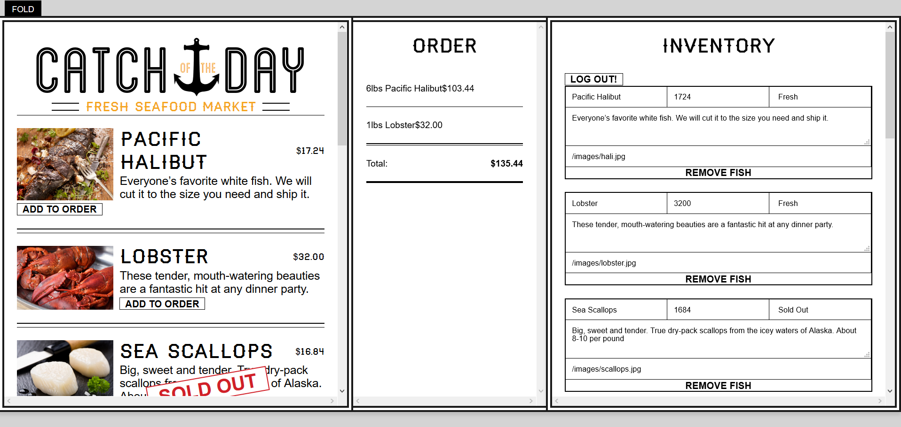

### ReactShoppingCart
Live: https://reverent-brattain-d84f52.netlify.com/

## How it works:

- React router first takes you to landing page 
- On landing page you see an input field and a button, a default "store" name will show but you can type in anything you want. Essentially every address is a unique store
- The store name is stored in a react ref, something like state but more relative to the current component, and temporary
- When button is pressed, the url is changed and react router will display instead a page for that "store" which will have the current available merchandise, if any, a tab, and a login
- The login exists so only one user is able to change the content of one store. Anybody can build up the tab because the tab persists on local storage. Login is through FaceBook, Twitter, or GitHub, using Firebase's oauth authentication.
- When somebody logs in, if a store hasn't been claimed yet, this visitor becomes the owner, otherwise it'll say sorry but you're not the owner
- State is persistent across sessions. It lives on the main App component and has two parts, fishes available, and the current order.
- Order is stored on local storage. When a user revisits the page, the order is loaded almost immediately but the fishes take a split second longer so that makes the order component buggy
- The fishes state is stored on firebase, changes on either firebase or the app changes the other
- If the fish state hasn't come in yet, the order list won't render because it won't be able to fetch the name and price of the fish, but when the fishes state comes in, it'll automatically update because React updates on state changes
- App has multiple functionalities. In the order you can delete an order or add to it. You can add fishes and delete them. You can load sample fishes. All are handled in a similar fashion, creating methods at a top level to change state (making a new state object and replacing the old one), and passing them down to the components.

